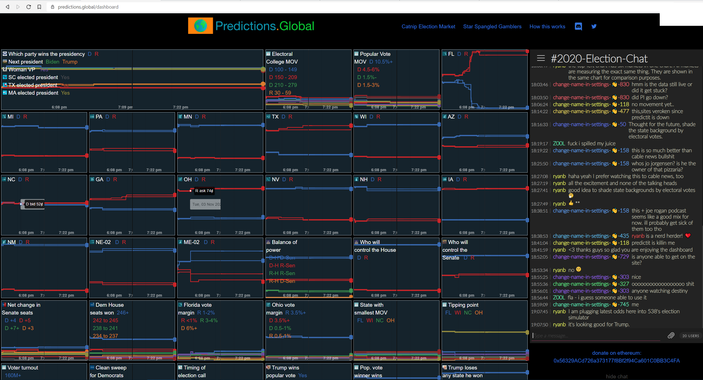

# Predictions.Global site

This site allows users to browse Augur markets, using a cached data dump generated by [Augur Analyzer](https://github.com/veilco/augur-analyzer) (which talks to a special version of [Augur Node](https://github.com/veilco/augur-node)).

# Prediction markets real-time price chart

This codebase contains a real-time price chart implementation for prediction markets.

It was designed by world-class prediction market traders, and shows real-time price feeds for dozens of markets on one large monitor.

Screenshot:

[Chart code](src/RealTimePriceChart.tsx)
